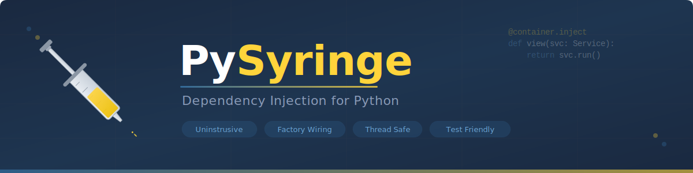

<p align="center">
  
</p>

<p align="center">
  <a href="https://github.com/hugochinchilla/pysyringe/actions/workflows/test.yml"></a>
  <a href="https://codecov.io/gh/hugochinchilla/pysyringe"></a>
  <a href="https://badge.fury.io/py/pysyringe"></a>
  <a href="https://www.hugochinchilla.net/pysyringe/"></a>
</p>

<p align="center">
  <strong>Dependency injection for Python that keeps your domain clean.</strong>
</p>

Your business logic should not know a DI container exists. No decorators on your classes, no registration boilerplate. PySyringe resolves dependencies through type hints and injects them at the call site --- your HTTP handlers, CLI commands, or message consumers --- so the rest of your code stays framework-free.

## ✨ Features

- 🚀 **Zero-decorator DI**: keep your domain clean; inject only at call sites.
- 🎯 **Explicit injection with `Provide[T]`**: mark exactly which parameters should be injected — no conflicts with framework signatures.
- 🏭 **Factory-based wiring**: resolve by return type annotations on your factory.
- 🧩 **Inference-based construction**: auto-wire constructor dependencies by type hints.
- 🧪 **Test-friendly mocks**: replace any dependency per test with `use_mock(...)`.
- 🔒 **Thread-safe mocks**: mocks are stored per-thread; aliases are global.
- 🧰 **Aliases**: map interfaces to implementations without writing factory methods.
- ⚡ **Resolution cache**: caches factory lookups and constructor introspection (not instances).

## Installation

```
pip install pysyringe
```

## Example

```python
from myapp.domain import EmailSenderInterface
from myapp.infra import LoggingEmailSender, SmtpEmailSender


class Factory:
    def __init__(self, environment: str) -> None:
        self.environment = environment

    def get_mailer(self) -> EmailSenderInterface:
        if self.environment == "production":
            return SmtpEmailSender("mta.example.org", 25)
        return LoggingEmailSender()
```

Factory methods can also receive the container to resolve sub-dependencies. Just add a `container: Container` parameter:

```python
from pysyringe.container import Container


class Factory:
    def get_mailer(self, container: Container) -> EmailSenderInterface:
        config = container.provide(AppConfig)
        if config.environment == "production":
            return SmtpEmailSender(config.smtp_host, config.smtp_port)
        return LoggingEmailSender()
```

The container passes itself automatically when it detects a `Container`-typed parameter. This means your factory benefits from the container's full resolution capabilities (inference, mocks, overrides, and aliases). Factory methods without a `Container` parameter continue to work as before.

### 2) Create the container

```python
from os import getenv
from pysyringe.container import Container

factory = Factory(getenv("ENVIRONMENT", "development"))
container = Container(factory)
```

### 3) Configure aliases

`alias(interface, implementation)` maps an interface to a concrete class without needing a factory method. The container builds the implementation using constructor introspection, recursively resolving its dependencies.

```python
from myapp.domain import CalendarInterface
from myapp.infra import Calendar

container.alias(CalendarInterface, Calendar)
```

### 4) Inject at the call site

Use `@container.inject` combined with `Provide[T]` type markers to indicate which parameters should be injected. Only parameters annotated with `Provide[T]` are injected; all others are left for the caller. This makes `@container.inject` safe to use with any framework (Django, Flask, Dramatiq, etc.) since the container never interferes with framework-controlled parameters.

A complete Django example:

```python
# views.py
from django.http import HttpRequest, HttpResponse
from pysyringe.container import Container, Provide
from myapp.domain import CalendarInterface
from myapp.infra import Calendar

container = Container()
container.alias(CalendarInterface, Calendar)

@container.inject
def get_now(request: HttpRequest, calendar: Provide[CalendarInterface]) -> HttpResponse:
    return HttpResponse(calendar.now().isoformat())
```

`request` is provided by Django as usual. `calendar` is injected by the container. No `never_provide()` needed — the container only touches what you explicitly mark.

### 5.1) Test with mocks (new syntax)

```python
import pytest
from pysyringe.container import Container
from myapp.domain import UserRepository
from myapp.usecases import SignupUserService
from myapp.infra.testing import InMemoryUserRepository


def test_create_user():
    user_repository = InMemoryUserRepository()
    with container.override(UserRepository, user_repository):
        service = container.provide(SignupUserService)

    service.signup("John Doe", "john.doe@example.org")

    assert user_repository.get_by_email("john.doe@example.org")
```

### 5.2) Test with mocks (old syntax)

Mocks are thread-local. Configure them per-test and clear afterwards.

```python
import pytest
from pysyringe.container import Container
from myapp.domain import UserRepository
from myapp.usecases import SignupUserService
from myapp.infra.testing import InMemoryUserRepository


@pytest.fixture(autouse=True)
def clear_container_mocks_after_each_test():
    yield
    container.clear_mocks()


def test_create_user():
    user_repository = InMemoryUserRepository()
    container.use_mock(UserRepository, user_repository)
    service = container.provide(SignupUserService)

    service.signup("John Doe", "john.doe@example.org")

    assert user_repository.get_by_email("john.doe@example.org")
```

### ⚡ Resolution cache

PySyringe includes a lightweight resolution cache to speed up dependency resolution without caching instances.

**What is cached:**
  - A precomputed map of factory methods keyed by their return type (built once at `Container` initialization) for O(1) lookups.
  - Constructor parameter introspection is LRU-cached to avoid repeated signature parsing and type disambiguation.

**What is NOT cached:**
  - Resolved instances. The cache accelerates how dependencies are located and wired, not the objects produced.

This means singleton semantics or any custom sharing strategy you define remain unchanged. The cache only reduces overhead during resolution.

### 🧷 Singleton helpers

PySyringe provides two singleton helpers for use inside your factory methods. Both cache instances keyed by the class and its constructor arguments.

| Helper | Scope | Use case |
|--------|-------|----------|
| `singleton()` | Global (shared across threads) | Thread-safe resources like connection pools or HTTP clients |
| `thread_local_singleton()` | Per-thread | Resources that are not safe to share, like database sessions |

#### `singleton()` — shared across all threads

```python
from pysyringe.singleton import singleton
from pysyringe.container import Container


class DatabaseClient:
    def __init__(self, connection_string: str) -> None:
        self.connection_string = connection_string


class Factory:
    def get_database_client(self) -> DatabaseClient:
        return singleton(DatabaseClient, "postgresql://localhost:5432/mydb")


container = Container(Factory())

client1 = container.provide(DatabaseClient)
client2 = container.provide(DatabaseClient)
assert client1 is client2  # Same instance, even across threads
```

Creation is thread-safe: concurrent threads calling `singleton()` for the same key will never produce duplicate instances (double-checked locking).

#### `thread_local_singleton()` — one instance per thread

```python
from pysyringe.singleton import thread_local_singleton


class Factory:
    def get_session(self) -> DatabaseSession:
        return thread_local_singleton(DatabaseSession, "postgresql://localhost:5432/mydb")
```

Each thread gets its own `DatabaseSession` instance. Within the same thread, repeated calls return the same object. This is useful for resources that are not thread-safe, such as database sessions or request-scoped state.

#### Notes

- The cache key includes: the class, positional args, and keyword args (order-independent for keywords).
- Perfect for database connections, HTTP clients, or any resource that should be shared per configuration.

### 🔒 Thread safety

The `Container` is thread-safe with respect to mocks. Mocks configured after the container has been created are stored in thread-local storage, so changes made to mocks in one thread do not affect other threads.

- **Shared across all threads**: `alias(...)` and the factory configuration (methods on your factory used for resolution).
- **Thread-local**: `use_mock(...)` and `clear_mocks()` operate only on the calling thread's mock store.

Implications:
- Using `use_mock(SomeType, mock_instance)` in one thread will not change what another thread receives for `SomeType`.
- Calling `clear_mocks()` clears only the current thread's mocks.
- To share a behavior globally across threads, prefer `alias(...)` or implement a factory method instead of relying on mocks.
